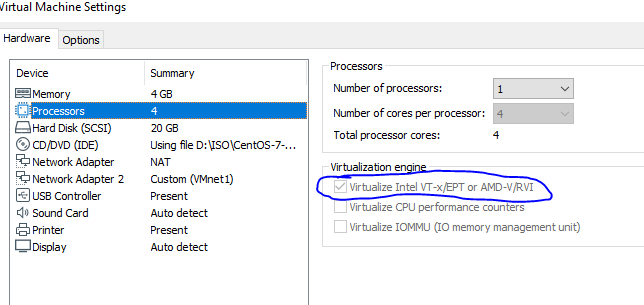

### Minukube on CentOS7 with VMWare Workstation.

You need to have a CentOS installed with at least 4vCPU and 4GB-s of RAM.

You also need to enable virtualization.



We need to have a user which is not root but has sudo access.

Download minikube.

``` bash
curl -Lo minikube https://storage.googleapis.com/minikube/releases/latest/minikube-linux-amd64 
sudo mv ./minikube /usr/local/bin/
sudo chmod +x /usr/local/bin/minikube
```

Download kubectl.

``` bash
curl -LO https://storage.googleapis.com/kubernetes-release/release/`curl -s https://storage.googleapis.com/kubernetes-release/release/stable.txt`/bin/linux/amd64/kubectl
sudo mv ./kubectl /usr/local/bin/
sudo chmod +x /usr/local/bin/kubectl
```

If we did everything correctly we should be able to issue the following commands, **minikube version** and **kubectl version**.

The output would be something like this.


