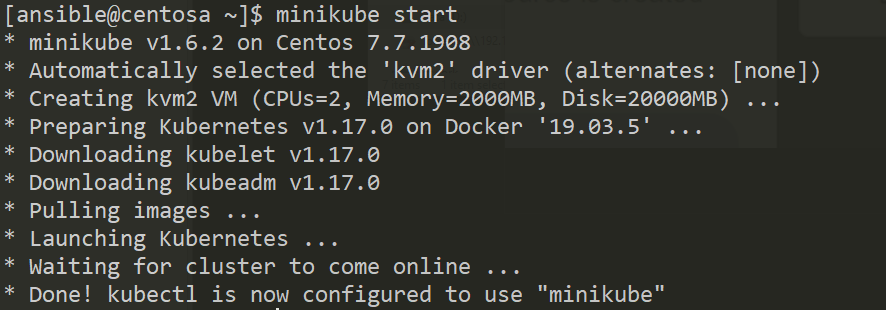

### Minukube on CentOS7 with VMWare Workstation.

**Minikube user: docker**
**Minikube pass: tcuser**

You need to have a CentOS installed with at least 4vCPU and 48GB-s of RAM.

You also need to enable virtualization.


We need to have a user which is not root but has sudo access.

Download minikube.

``` bash
curl -Lo minikube https://storage.googleapis.com/minikube/releases/latest/minikube-linux-amd64 
sudo mv ./minikube /usr/local/bin/
sudo chmod +x /usr/local/bin/minikube
```

Download kubectl.

``` bash
curl -LO https://storage.googleapis.com/kubernetes-release/release/`curl -s https://storage.googleapis.com/kubernetes-release/release/stable.txt`/bin/linux/amd64/kubectl
sudo mv ./kubectl /usr/local/bin/
sudo chmod +x /usr/local/bin/kubectl
```

If we did everything correctly we should be able to issue the following commands, **minikube version** and **kubectl version**.

The output would be something like this.


Now let's install dependencies.

``` bash
sudo yum install qemu-kvm libvirt libvirt-python libguestfs-tools virt-install -y
```

Let's enable startup on boot for the **libvirtd** service, and start it now.

``` bash
systemctl enable libvirtd
systemctl start libvirtd
```

There is a catch however, you need to add your user to the **libvirt** group. 

``` bash
usermod --append --groups libvirt `whoami`
```

Now we are ready to start minikube with the **minikube start** command, after the system was rebooted.



You can get status of your minikube with the following command aswell.


Getting status of the kubernetes setup is done with **kubectl get all** command.


In order to apply a pod definition yaml you issue the following command.

``` bash
kubectl apply -f <filename.yaml>
```

Gather information about a pod.

``` bash
kubectl describe pod <name>
```

Get the IP of the minikube.

``` bash
minikube ip
```

Execute a command in a pod.

``` bash
kubectl exec <name> <command>
```

Open up an interactive shell.

``` bash
 kubectl -it exec <name> sh
```

Delete pod or service, it will gracefully terminate

``` bash
kubectl delete pod/service <name>
```

Delete every pod or service or replica set.

``` bash
kubectl delete po/svc --all
```

Deployments provide a 0 downtime rolling update!

Applying a changed deploment yaml will perform a rolling upgrade.

Getting rollout status of a deployment.

``` bash
kubectl rollout status deploy <name>
```

Get deployment history.

``` bash
kubectl rollout history deploy <name>
```

Undo deployment.

``` bash
kubectl rollout undo deploy <name> --to-revision=<id>
```

When you do a rollout or rollback your configuration files can drift from your yaml files.

# Networking and service discovery

Namespaces help separate network segments like front-end and back-end.

**kubectl get all <namespace>** helps you navigate namespaces.

**kubectl get namespaces** gives you a list of namespaces.

Builtin namespaces:
- kube-public
- kube-system

**kubectl get pods -n kube-system** gives you the list of pods that come by default with minikube.

**kubectl describe service kube-dns -n kube-system** we can describe other entities in different namespaces by defining the one it lives in.

nslookup tells you the namespace of the resolved IP if it's present.

In order to delete every resource **kubectl delete -f .**

In order to get the logs for a specific pod **kubectl logs -f <podname>**, only pods produce logs.

ClusterIP is exposed to other pods, NodePort is exposed to the outside world.

A Service becomes a DNS entry which help map ports to specific pods.

In order to get a list of persistent volumes issue the **kubectl get pv**

**DaemonSet** is like a **ReplicaSet** but knows it needs to run on every node.

**StatefulSet** are special in a sense that they have stable names, not random stuff.